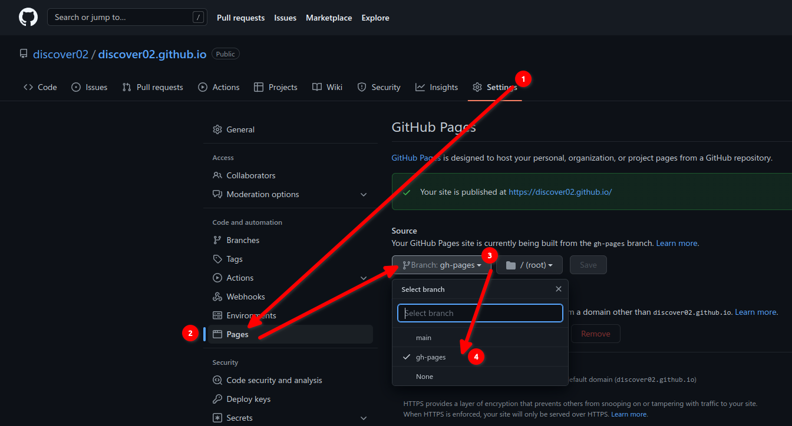

+++
title = "My first blog about Making a website with 'Github' and 'Hugo' "
author = ["Ali Ruhi Unal"]
description = "How to make a Website with 'Hugo' and make it online with 'GitHub' "
date = 2023-07-28
tags = ["hugo", "github-pages"]
draft = false
+++

# **First Post**

## *First post of my first website, yea i know its weird but why not? Today im gonna make a documentation about how i host here and make this website for totally free.*

### **LETS START!**


# 1 Step

 First you need to create a repo in your GitHub account.
So login to your GitHub account and click your profile photo icon then click 'Your Repositories'
And create a new one named 'yourname.github.io'

# 2 Step


 Then you need to install 'Hugo'
 
```bash
| Arch | sudo pacman -S hugo |
| Debian/Ubuntu | sudo apt install hugo |
| Fedora | sudo dnf install hugo |
| Gentoo | sudo emerge --ask www-apps/hugo |
| OpenSUSE | sudo zypper in hugo | 

```

# 3 Step

If you are using Linux many of them got already installed git

```bash 
| Arch : sudo pacman -S git |
| Debian / Ubuntu : sudo apt install git |
| Fedora : sudo dnf install git |
| Gentoo : sudo emerge --ask dev-vcs/git |
| OpenSUSE : sudo zypper in git |

```

# 4 Step


So the requirements done from now on, Lets go!
First we need to send our 'repo' to our pc i mean terminal
```bash
$ cd ~/Documents
 $ git clone https://github.com/username/username.github.io
```
After that we need to install 'hugo' to inside 'repo'
```bash
 $ hugo new site username.github.io --force
 $ cd username.github.io
```
Lets configure 'Hugo'

```bash
baseURL = 'https://username.github.io'
languageCode = 'en-us'
title = "Enter title"
theme = "hugo-coder"

[author]
  name = "My name"
  email = "example@example.com"

[markup.goldmark.renderer]
  unsafe = true

[params]
  author = "My name"
  info = "Enter text"
  description = "Enter text"
  keywords = "blog"
  colorScheme = "dark"

[[params.social]]
  name = "Github"
  icon = "fa fa-github fa-2x"
  weight = 1
  url = "https://github.com/username"
[[params.social]]
  name = "RSS"
  icon = "fa fa-2x fa-rss"
  weight = 6
  url = "index.xml"
  rel = "alternate"
  type = "application/rss+xml"

[[menu.main]]
  name = "Blog"
  weight = 1
  url = "posts/"
```

# 5 Step 

Dont forget to save it then we need to find a theme from *Hugo* I will use 'hugo-coder'

```bash
   $ git submodule add https://github.com/luizdepra/hugo-coder.git themes/hugo-coder
```
Then we need to get our website refreshed on every change we did so this code will help us
```bash
 $ mkdir .github/workflows -p
 $ nano .github/workflows/gh-pages.yml          #Paste them to this direction

 name: github pages

 on:
   push:
     branches:
       - main  # Set a branch to deploy
   pull_request:

 jobs:
   deploy:
     runs-on: ubuntu-20.04
     steps:
       - uses: actions/checkout@v2
         with:
           submodules: true  # Fetch Hugo themes (true OR recursive)
           fetch-depth: 0    # Fetch all history for .GitInfo and .Lastmod

       - name: Setup Hugo
         uses: peaceiris/actions-hugo@v2
         with:
           hugo-version: 'latest'
           extended: true

       - name: Build
         run: hugo --minify

       - name: Deploy
         uses: peaceiris/actions-gh-pages@v3
         if: github.ref == 'refs/heads/main'
         with:
           github_token: ${{ secrets.TOKEN }} #You need to fill blank with your Token (Classic) dont forget to make permissions ticked 
           publish_dir: ./public
```
You can use [this](https://github.com/settings/tokens) link for Token.
 
# 6 Step


When you save and exit fifth step
```bash
$ hugo              # Required to save last changes
$ git add .
$ git commit -m "HugoSetup"
$ git push -u origin main -f             ## Now it will ask for your username and password. Enter your GitHub username  
                                         #  then you need to enter your token which starts with ghp to password section.
```
While files uploading to GitHub wait 1-2 Minutes when its done follow these 


# 7 Step

Now our website is ready! If u have a custom domain you can use it to publish your website too. Also if you want to make a new post like that tutorial
https://github.com/username/username.github.io/content/posts/mynewpost.md use this directory.
